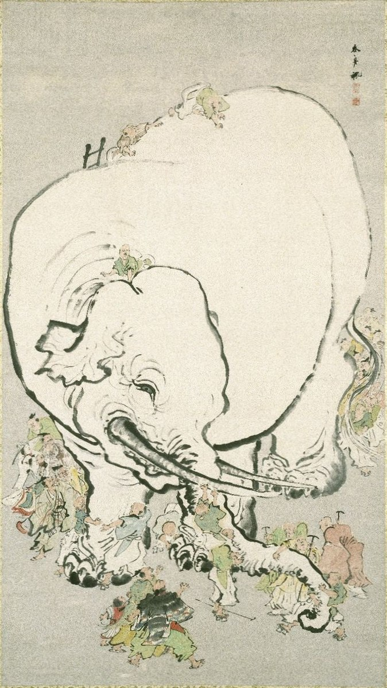

<div class="row">
<div class="col-sm-6">

The parable of the blind men and an elephant originated in the ancient Indian subcontinent, from where it has been widely diffused. It is a story of a group of blind men who have never come across an elephant before and who learn and imagine what the elephant is like by touching it. 

Each blind man feels a different part of the elephant's body, but only one part, such as the side or the tusk. They then describe the elephant based on their limited experience and their descriptions of the elephant are different from each other. In some versions, they come to suspect that the other person is dishonest and they come to blows. 

The moral of the parable is that humans have a tendency to claim absolute truth based on their limited, subjective experience as they ignore other people's limited, subjective experiences which may be equally true. (Wikipedia)

</div>
<div class="col-sm-6">

```{r MCAIllu, out.width=250, echo=F,fig.cap="Blind Men Appraising an Elephant (Ohara Donshu - Online Collection of Brooklyn Museum)",fig.align='center'}

```

</div>
</div>